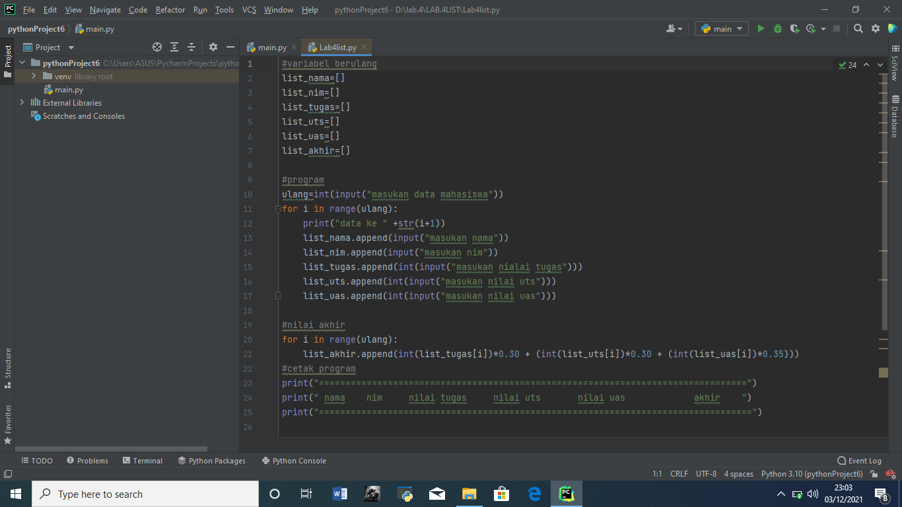
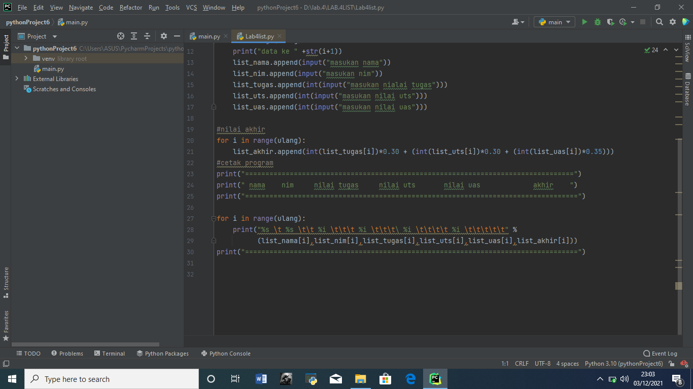
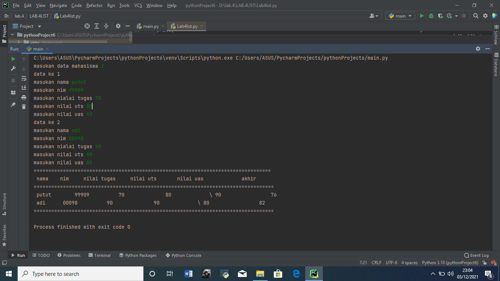

# LAB.4LIST
Membuat program sederhana untuk menambhan data dalam sebuah list
program yang saya buat memuat fungsi list dan perulangan 
berikut merupakan gambar struktur pemograman saya

untuk dapat memulai program dibutuhkan variabel yang memuat list 
maka dapat dituliskan dengan cara a=[]
karena pada bagaian pertama pogram isi list masih kosong maka dibutuhkan 
fungsi append() yaitu fungsi pada list untuk menambahkan isi dalam list
karena bersifat perulangan maka sebelum memulai mengisikan list pada fungsi append()
sebelumnya menggunakan fungsi perulangan yaitu for
karena sebagaian nilai bersifaf str maka saat pengisian nilai integer menggunakan fungsi int()
setelah menginput dan menghitug nilai akhir yang terakhir ialah menampilkan output
dimana output adayang bersifat string dan integer 
berikut hasil output program saya:

